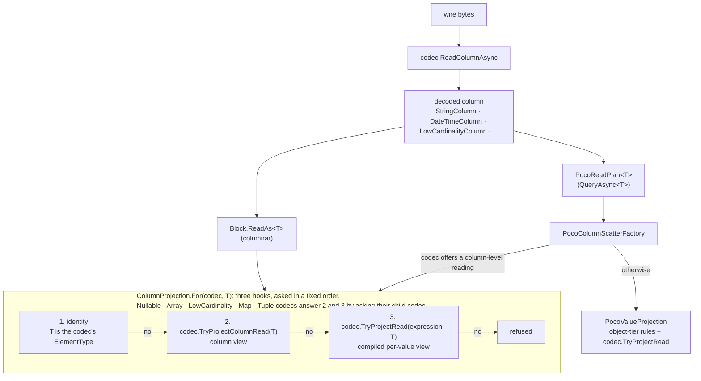
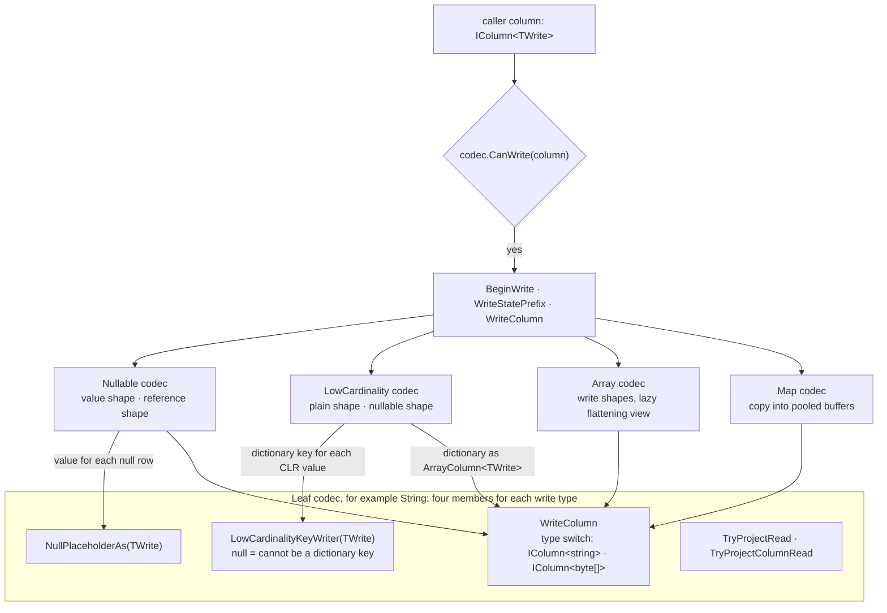
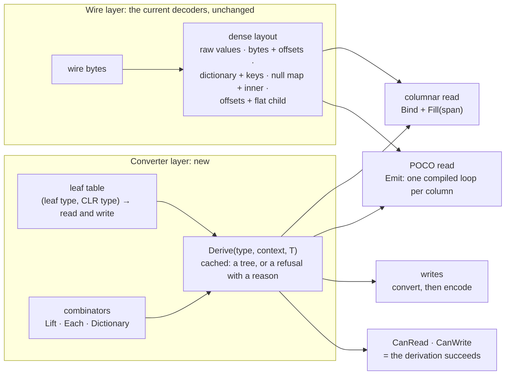
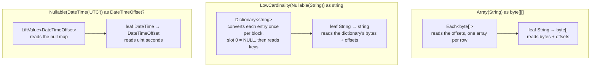
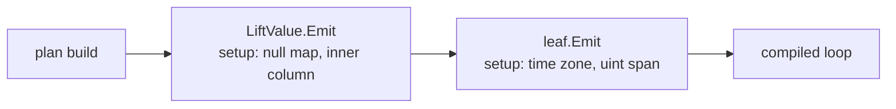
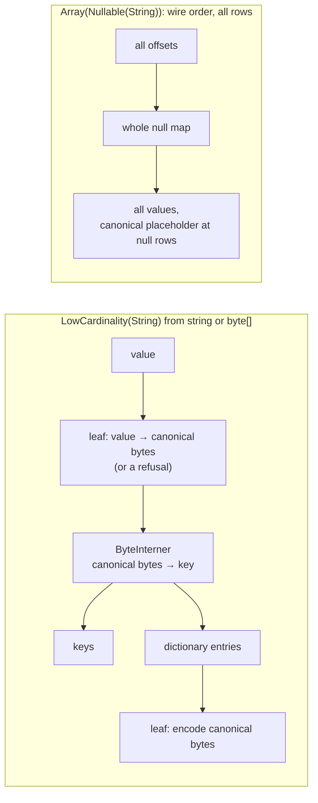

# Spike: wire layer plus converter combinators (ClickHouse/integrations#801)

A quick, partial prototype. It is not production code and it is not for merge.

## What the spike implements

- **Leaf converters.** `DateTime` to `DateTimeOffset` and `uint`; `String` to `string` and `byte[]`.
  Writes: `DateTime` from `DateTimeOffset`; `String` and `FixedString(N)` from `string` and `byte[]`.
  Each leaf conversion is one entry in a table (`ReadDerivation.Leaves`, `WriteDerivation.Leaves`).
- **Combinators.** Read: `LiftRef`, `LiftValue` (Nullable), `Each` (Array), `DictionaryReader`
  (LowCardinality, including `LowCardinality(Nullable(X))` for reference types). Write: `LiftValueWriter`,
  `EachWriter`, `DictionaryWriter`.
- **One derivation** (`ReadDerivation.Derive(type, context, T)`), cached by type string, timezone, and `T`.
  The columnar tier and the POCO tier both use it.
- **Two ways to run a derived tree.** Each node has `Bind(column).Fill(start, span)`, a bulk path with no
  dynamic code. Each node also has `Emit(column, row, scope)`, which returns an expression for one row and
  puts its per-block setup (casts, span locals, the converted dictionary) before the loop. The fused POCO
  plan (`FusedPocoPlan`) splices the whole tree into one compiled loop per column (issue item 5).
- **No new wire layer.** The current decoders already produce the dense layout: `DateTimeColumn` holds raw
  `uint` seconds, `StringColumn` holds a blob and offsets, LowCardinality holds a dictionary and keys,
  Nullable holds a null map and an inner column, Array holds offsets and a flat child. The spike reads those
  through the existing surfaces (`IStringColumn`, `INullableColumn`, `IArrayColumn`, `ILowCardinalityColumn`).

The only change outside `spikes/` is one `InternalsVisibleTo` line in `ClickHouse.Driver.Tcp/AssemblyInfo.cs`.

## Diagrams

### Current structure: read

Each codec answers the conversion questions itself. A composite codec answers them again and forwards to
its children. The POCO tier adds its own rules on top.



### Current structure: write

For each leaf type and each write type, four members must agree. Each composite has its own family of write
shapes, doubled for value types and reference types.



### Candidate structure: layers

The decoders stay as they are, because they already produce the dense wire layout. One derivation builds a
converter tree from a type string and a CLR type, and every tier uses that tree.



### Candidate structure: derived trees

Two trees the spike derives. Each node reads only its own part of the dense layout.



### Candidate structure: the fused POCO loop

`Emit` runs down the tree once, when the plan is built. Each node adds its setup before the loop and returns
an expression for one row. The result is one compiled loop per column, for example for
`Nullable(DateTime('UTC'))` into a `DateTimeOffset?` property:



```csharp
// before the loop: one time for each window of rows
var nulls   = ((INullableColumn)column).NullMap;
var inner   = ((INullableColumn)column).Inner;
var seconds = ((IColumn<uint>)inner).Values;

// the loop
for (int i = 0; i < count; i++)
{
    int r = start + i;
    rows[i].Ndt = nulls[r] != 0 ? null : DateTimeToOffset(seconds[r], zone);
}
```

### Candidate structure: writes

A writer converts each value to its canonical value just before it encodes it. A composite writes each of
its streams across all rows, so `Each` passes the rows' arrays to its child as one list of segments.



## Correctness

`dotnet run -c Release -- verify` compares every result with the current client, on 10,000 rows:

- Every columnar read gives the same values as `Block.ReadAs<T>`.
- The POCO read of a 6-column mixed row gives the same rows as `PocoReadPlan<T>`, for the bulk plan and for
  the fused plan. The fused plan reads in windows of 4,096 rows, as the client does.
- Every write gives **the same bytes** as `IColumnCodec.WriteFull`, including the LowCardinality dictionary
  order and the reserved slots.
- `LowCardinality(FixedString(N))` from `string`: the current client refuses it (`CanWrite` is false,
  because `string` has no key writer for FixedString). The candidate writes it, and the bytes are the same as
  the current write from zero-padded `byte[]`. The canonical value gives this case with no extra code.

## Measurements

100,000 rows, in memory (no server), .NET 10, on a quiet 4-core box (load average below 2). Ratio < 1 means
the candidate is faster. The table comes from `dotnet run -c Release -- quick 61`, which runs the two arms
alternately, decodes a fresh block before each timed run, and reports the minimum and the median. Each cell
gives pass 1 / pass 2.

| Case | min ratio | median ratio |
|---|---:|---:|
| Columnar read, `Array(String)` as `byte[][]` | 0.86 / 0.84 | 0.82 / 0.80 |
| Columnar read, `LowCardinality(String)` as `byte[]` | 0.49 / 0.49 | 0.49 / 0.48 |
| Columnar read, `Nullable(DateTime)` as `DateTimeOffset?` | 0.70 / 0.72 | 0.71 / 0.71 |
| Columnar read, `DateTime` as `DateTimeOffset` | 0.70 / 0.70 | 0.69 / 0.71 |
| Columnar read, `String` as `string` | 1.09 / 1.06 | 1.09 / 1.08 |
| Columnar read, `LowCardinality(Nullable(String))` as `string` | 0.86 / 0.73 | 0.79 / 0.72 |
| Columnar read, wide mixed row (6 columns) | 0.83 / 0.79 | 0.81 / 0.82 |
| POCO read, fused, `Array(String)` as `byte[][]` | 0.79 / 0.81 | 0.80 / 0.81 |
| POCO read, fused, `LowCardinality(String)` as `byte[]` | 0.71 / 0.69 | 0.69 / 0.67 |
| POCO read, fused, `Nullable(DateTime)` as `DateTimeOffset?` | 0.84 / 0.85 | 0.83 / 0.85 |
| POCO read, fused, `DateTime` as `DateTimeOffset` | 0.96 / 0.98 | 0.94 / 0.98 |
| POCO read, fused, `String` as `string` | 0.97 / 1.00 | 0.97 / 0.97 |
| POCO read, fused, `LowCardinality(Nullable(String))` as `string` | 0.77 / 0.75 | 0.76 / 0.73 |
| POCO read, fused, wide mixed row | 0.82 / 0.82 | 0.82 / 0.83 |
| POCO read, bulk (fill, then assign), wide mixed row | 1.11 / 1.08 | 1.11 / 1.08 |
| Write `LowCardinality(String)` from `string`, 100 distinct | 1.61 / 1.60 | 1.91 / 1.90 |
| Write `LowCardinality(String)` from `string`, all distinct | 0.89 / 0.91 | 0.89 / 0.94 |
| Write `LowCardinality(FixedString(16))` from `byte[]`, 100 distinct | 0.85 / 0.82 | 0.83 / 0.77 |
| Write `LowCardinality(FixedString(16))` from `byte[]`, all distinct | 0.64 / 0.63 | 0.66 / 0.64 |
| Write `Nullable(DateTime)` from `DateTimeOffset?` | 0.99 / 0.94 | see below |
| Write `Array(String)` from `string[]` | 1.37 / 1.03 | 1.30 / 1.03 |

BenchmarkDotNet (`bench --filter '*'`, one invocation per iteration on a fresh block) gives the same
directions. Means, current against fused POCO: wide row 13.3 ms against 10.2 ms, `Array(String)` 5.4 ms
against 4.4 ms, `DateTime` 3.0 ms against 3.0 ms. The bulk POCO plan is between the two.
Writes, with errors of 2% to 4%: `LowCardinality(String)` 100 distinct 1.50, all distinct 0.85;
`LowCardinality(FixedString(16))` 0.82 and 0.68; `Nullable(DateTime)` 0.93; `Array(String)` 0.98.
BenchmarkDotNet puts `LowCardinality(Nullable(String))` as `string` at 0.24 for the fused POCO plan. The
interleaved timings give 0.75. The spike did not find the cause of that difference.

The `Nullable(DateTime)` write medians are about 2x their minimums for **both** arms. The run is too short
for tiered compilation to finish on that fast case. With `DOTNET_TieredCompilation=0`, the candidate is
0.75x.

Not measured: `InsertRowsAsync<T>` (the POCO write tier), anything against a server.

### Measurement traps found on the way

- **Column caches.** `StringColumn` and the LowCardinality columns cache their decoded values on the first
  access. A benchmark that reuses one block measures cache hits for the current client after the first
  round. Together with the next item, this made the wide POCO row look 1.2x slower for the candidate, when
  it is 0.8x. Decode a fresh block for each timed run.
- **`new TRow()`.** A generic `new()` compiles to `Activator.CreateInstance<TRow>()`. The current plan uses a
  compiled constructor. Before the spike used one too (`PocoActivator`), every single-column POCO read looked
  10% to 30% slower. Emitting the exact expressions of the current scatter did not change that, which is how
  the activator was found.
- **Shared box.** Under load 15 to 48, BenchmarkDotNet means had errors larger than the means, and its
  out-of-process build hit its 2-minute timeout.

## Answers to the questions in the issue

**Read performance.** Yes, a derived tree compiled into a loop is as fast as the current spliced
expressions, and faster for composites.

- Columnar: 0.5x to 0.85x, except `String` as `string` at about 1.08x. In that case the arms do not return
  the same thing: the current `ReadAs<string>` returns the column itself, whose `Values` decodes into a
  pooled array that the block owns. The spike fills a new `string[]` that the caller owns, which is a
  large-object-heap allocation at 100,000 rows.
- POCO, fused: 0.67x to 1.0x. The leaf-only cases (`String`, `DateTime`) are at parity, as they must be:
  each row does the same work. The composites are faster. For LowCardinality, the dictionary converts once
  per block. For Nullable and Array, the spike did not isolate the cause.
- POCO, bulk: 0.85x to 1.1x. It makes two passes (fill a pooled buffer, then assign). It needs no compiled
  code to read values, so it is the fallback when dynamic code is not available.

**Write performance.** Parity or better for Nullable, Array, and the FixedString dictionary.

**LowCardinality writes.** "Convert, then intern canonical values" is faster for `FixedString` from
`byte[]` (0.65x to 0.85x) and for `String` when values are mostly distinct (0.9x). It is **1.5x to 1.6x
slower for `String` from `string` with many repeats**. The canonical value of a `string` is its UTF-8 bytes,
so each row is encoded before it is hashed, while the current writer hashes the `string` directly. To fix
this, the leaf can offer an optional "CLR key" fast path when equal CLR values always have equal canonical
values (`string` into `String`). That brings back one comparer for each write type, but only as an
optimization, not as a requirement for correctness. The spike does not implement it.

**Public API.** No change is necessary. `StringColumn` already stores bytes plus offsets and decodes text
when asked. Text stays the default read type.

**Migration.** Reads can change in steps. The converter layer sits on the existing column surfaces, so a
derived reader can go behind `ColumnProjection.For` and `PocoColumnScatterFactory` one composite at a time,
with no change to the codecs. Writes are harder: the codecs' `WriteColumn` takes an `IColumn` and the write
shapes, so the write combinators need their own entry point next to `IColumnCodec`.

**Members that go away.**

- `TryProjectColumnRead`: the combinator chooses bulk or per value, so there is one hook.
- `NullPlaceholderAs`: one canonical placeholder for each leaf (`LeafWriter.WritePlaceholders`).
- `LowCardinalityKeyWriter` and the comparers: the dictionary interns canonical bytes (`ByteInterner`).
  Fixed-width leaves need a second interner over `TCanon`, which the spike does not have.
- The Nullable, LowCardinality, and Array write shapes: replaced by three write combinators.
- `ClaimsValue` stays, for Variant.

**Ahead-of-time compilation.**

- Leaves work: the table has closed generic types over struct converters, written in source.
- Building the tree does not: `Derive` makes `LiftValue<T>`, `Each<T>`, and `DictionaryReader<T>` with
  `MakeGenericType` from a runtime `Type`. A generic `Derive<T>()` entry point does not help, because the
  recursion must take `T[]` apart into `T`, which needs reflection. For value-type arguments this needs
  dynamic code. Options: a source generator for the POCO types, or a tree over `object`.
- The fused loop does not: it uses `Expression.Compile` with `ReadOnlySpan` locals, which the expression
  interpreter cannot run. The current code has the same limit, and it falls back to its indexer tier. Here
  the fallback is the bulk `Fill` path, at 0.85x to 1.1x.

## Problems found

1. **The value and reference doubling stays in Nullable.** A `Span<T?>` cannot be passed where a `Span<T>`
   is expected. So the bulk `LiftValue<T>` fills a pooled scratch buffer and copies, and `LiftRef<T>` fills
   in place. On write, `LiftValueWriter<T>` makes one virtual call into the leaf for each value. In the
   fused path the two lifts share one emit (`LiftEmit`). The doubling is now in one place and not in each
   family of shapes, but it does not go away.
2. **The bulk read path converts placeholder rows too.** `LiftRef.Fill` and `LiftValue.Fill` convert every
   row and then overwrite the null rows, so a leaf converter must accept the placeholder value. The fused
   path does not have this problem: its conditional converts only non-null rows.
3. **A composite writes each stream across all rows.** `Array(Nullable(X))` writes all the offsets, then
   the whole null map, then all values. So `EachWriter` cannot call its child once for each row. The spike
   passes the rows' arrays to the child as a list of segments, with no flat copy, but each Array level
   allocates (pools) one segment list.
4. **LowCardinality still looks at Nullable.** The dictionary of `LowCardinality(Nullable(X))` is a plain `X`
   column with NULL in slot 0. So the derivation for LowCardinality must unwrap a Nullable child, and a
   value-type target needs a lifting dictionary. This is a small special case, but it is a special case.
5. **Identity reads.** The current `ReadAs<T>` returns the column itself when it is already an `IColumn<T>`.
   The candidate always converts. A real version needs the same shortcut, which is the `String` as `string`
   columnar case above.
6. **Two definitions per node.** Each node has a bulk `Fill` and an `Emit`. They must agree, and the spike
   checks that only through `verify`. A real version could derive the bulk path from `Emit` when dynamic
   code is available, and keep `Fill` only as the fallback.
7. **Shared arrays.** LowCardinality read as `byte[]` gives the same array instance to every row that has the
   same key. The current client does the same.

## Related: ClickHouse/integrations#792 (`LowCardinality(String)` from `byte[]`)

`dotnet run -c Release -- issue792` checks `LowCardinality(String)`, `LowCardinality(Nullable(String))`, and
`Array(LowCardinality(String))` written from `byte[]`.

- **Cause in the current client.** `StringColumnCodec.LowCardinalityKeyWriter` returns a key strategy only
  for `string`, and `null` for `byte[]`. LowCardinality takes `null` to mean "this write type cannot be a
  dictionary key", so `CanWrite` is false and the insert is refused. The test
  `LowCardinalityKeyWriter_Bytes_IsUnavailableAndLowCardinalityRefusesThem` pins this. ClickHouse/clickhouse-cs#594 made the
  refusal on purpose, because an earlier version accepted the write and then threw part-way through it. It
  lists "`LowCardinality(String)` written from bytes" as a follow-up that needs a byte-comparing dictionary
  and a placeholder for each write type.
- **The candidate structure writes all three** with no code for this case. The bytes are the same as the
  current client's write of the same text. Bytes that are not valid UTF-8 (`0xFF`) round-trip unchanged,
  which no write through `string` can do.
- **The current structure can also fix it with one line.** Both parts that ClickHouse/clickhouse-cs#594 named exist in `main` now:
  the byte-content key `LowCardinalityKeys.Bytes()` (which `FixedString` uses) and
  `StringColumnCodec.NullPlaceholderAs(typeof(byte[]))`. With `byte[] => LowCardinalityKeys.Bytes()` added to
  the `String` key writer, the current client writes all three cases with the same bytes as the candidate.
  The Tcp unit tests (2,192, `net10.0`, no server) then fail only on the test above, which pins the refusal.
  The server-backed `CanWrite_ItsAnswer_IsWhetherTheInsertGoesThrough` case for
  `LowCardinality(String)` from `byte[]` was not run.
- **What this says about ClickHouse/integrations#801.** ClickHouse/integrations#792 is the comparer problem from ClickHouse/integrations#801 in small: in the current structure,
  each pair of write type and LowCardinality inner needs its own key strategy, and a missing one shows up as
  a refusal. In the candidate structure, the key is the canonical value, so any write type that converts
  to the leaf gets deduplication with no extra code.

## Decision proposed by the spike

**Adopt.** The fused loop removes the POCO regression. Reads in both tiers are as fast or faster, the
writes are as fast or faster except one case, each leaf conversion is one table entry, and the design adds a
missing write (`LowCardinality(FixedString)` from `string`). Two items to do before or during the change:

- The CLR-key fast path for `LowCardinality(String)` from `string`, so the high-repeat write is not 1.5x
  slower.
- The identity shortcut, and a decision on whether the columnar tier returns a borrowed or an owned array.

## How to run

```
cd spikes/WireConverterSpike
dotnet run -c Release -- verify
dotnet run -c Release -- issue792                     # LowCardinality(String) from byte[]
dotnet run -c Release -- quick 61                     # interleaved min/median timings
SPIKE_ONLY=Wide,StringAsString dotnet run -c Release -- quick 61
dotnet run -c Release -- bench --filter '*'           # BenchmarkDotNet; needs a quiet box
```

Experiment switches: `SPIKE_LEAF=direct` makes the `String` and `DateTime` leaves emit the same expressions
as the current scatter. `SPIKE_NEW=generic` makes the POCO plans construct rows with `new TRow()`.
